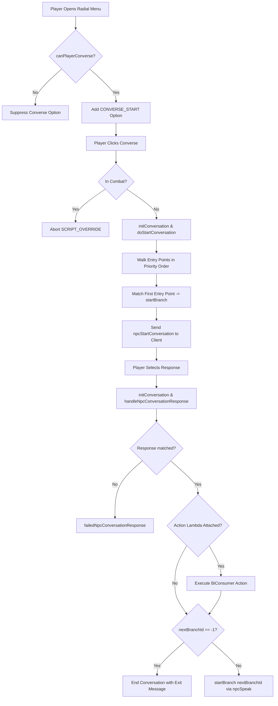

# Advanced Conversation Tool

A lightweight, declarative conversation framework for Star Wars Galaxies (NGE) server scripts.
This framework strips out the massive `switch-case` statements, manual player scriptvar management, and repetitive
trigger plumbing traditionally required to write branching NPC dialogues in SWG.

---

## Architecture Overview

The framework lives in the `script.tools.adv_conv_tool` package:

```
script/
└── tools/
    └── adv_conv_tool/
        ├── base_conversation.java          # Core lifecycle interface contract
        ├── base_conversation_script.java   # Low-level SWG trigger handler
        ├── advanced_conversation_tool.java # Declarative fluent builder layer
        ├── adv_conv_utils.java             # Stateless helpers (random animations)
        └── examples/
            ├── incursion_informant_convo.java
            └── sample_greeter_convo.java
```

### `base_conversation.java` (Interface)

Defines the standardized 5-step conversation lifecycle contract:

- `initConversation(npc, player)`: Sets up conversation IDs and prepares state before dialogue starts.
- `canPlayerConverse(npc, player)`: Gates whether the "Converse" radial option appears.
- `doStartConversation(npc, player)`: Aims the NPC at the player and serves the opening dialogue.
- `handleNpcConversationResponse(npc, player, conversationId, response)`: Catches player response clicks and drives
  branch transitions.
- `doEndConversation(npc, player)`: Tears down session state and delivers closing barks or animations.

### `base_conversation_script.java` (Base Trigger Handler)

Bridges native SWG server triggers to the `base_conversation` interface without exposing subclasses to engine plumbing:

- Automatically manages `CONDITION_CONVERSABLE` across spawns (`OnInitialize`), attachments (`OnAttach`),
  incapacitations (`OnIncapacitated`), and revivals (`OnRecapacitated`).
- Injects the `CONVERSE_START` radial option in `OnObjectMenuRequest` only if `canPlayerConverse` passes.
- Aborts talk attempts via `SCRIPT_OVERRIDE` in `OnStartNpcConversation` if either participant is in combat.
- Dispatches client dialogue packets (`OnNpcConversationResponse`) after calling `initConversation` and validating
  the matching `COMM_CONVO_ID` string.
- Provides fallback error recovery (`failedNpcConversationResponse`) if a response matches nothing: it barks an
  error, clears the branch scriptvar and closes the conversation.

`COMM_CONVO_ID` and `COMM_CONVO_BRANCH_ID` are **instance fields** with per-class defaults (the class's simple name,
and `conversation.<full class name>.branchId`). Subclasses may set them in `initConversation`.

### `advanced_conversation_tool.java` (Fluent Builder Tool)

Extends `base_conversation_script` and provides a fluent, lambda-driven builder:

- **Prioritized Entry Points**: Evaluates a list of `BiPredicate<obj_id, obj_id>` conditions in registration order to
  decide which branch ID opens the conversation.
- **Fluent Branch Construction**: Uses `createBranch(id)` and `convo_branch_builder` to chain spoken text, animations,
  and response options.
- **Inline Action Hooks**: Attaches `BiConsumer<obj_id, obj_id>` action lambdas directly to response choices (giving
  items, sending quest signals, triggering client animations) without touching response dispatch handlers.
- **Automated State Tracking**: Automatically manages and clears the player's active branch scriptvar
  (`COMM_CONVO_BRANCH_ID`) on start, transition, and exit.

### Rules for script authors

- The script engine keeps **one instance per script class**, shared by every NPC the script is attached to. The tree
  is rebuilt for the current (npc, player) before every radial, start and response. Never keep per-player state in
  fields; use scriptvars or objvars.
- Action lambdas must use their own `(_npc, _player)` parameters, never the `npc`/`player` arguments of
  `initializeConversationTree`.
- To end the conversation with a custom message, use `addExitResponse(text, endMessage[, action])`; do not call
  `npcEndConversationWithMessage` inside an action (the tool already ends the conversation).
- The tool classes are loaded by the system class loader (`script_class_loader.defaultLoad`): changes to them need a
  server restart, not a script reload.
- Text uses `new string_id(String)` (raw text, no .stf file needed).

---

## Conversation Lifecycle Flow



---

## API Reference & Builder Methods

### Entry Point Configuration

```java
// Register a custom condition lambda
addEntryPoint((_npc, _player) -> booleanCondition, startBranchId);

// Gate on an active ground quest task
addQuestEntryPoint("questName", "taskName", startBranchId);
```

### Branches

```java
createBranch(1)
        .setNpcAnimation("wave_hail")
        .setNpcMessage("Hello there.")
        .addResponse("Tell me more.", 2)
        .addExitResponse("Bye.", "Goodbye.", (_npc, _player) -> doAnimationAction(_player, "wave1"));
```
